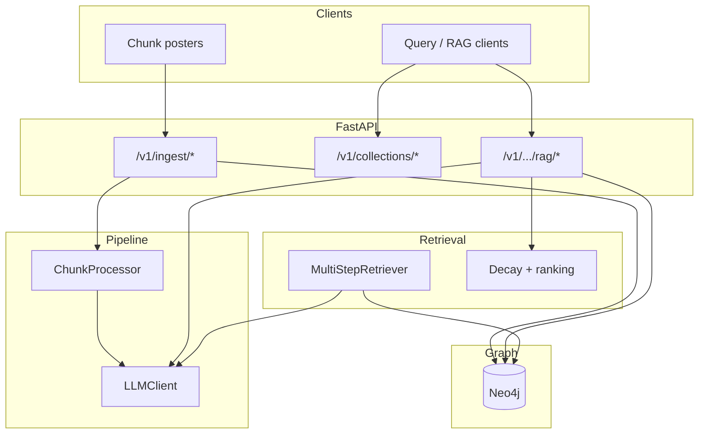

# Temporial Graph RAG — System design

This document synthesizes the **OpenAI Temporal Agents** tutorial material ([`temporal_agents.ipynb`](../temporal_agents.ipynb)), the **financial product extension** ([`PRODUCT_ENHANCEMENT.md`](../PRODUCT_ENHANCEMENT.md)), and the **codebase as implemented** in this repository. It is the canonical high-level design narrative for stakeholders and architects.

---

## 1. Reference documents

### 1.1 [`temporal_agents.ipynb`](../temporal_agents.ipynb)

The notebook demonstrates a temporal knowledge pipeline: structured extraction from text (statements, temporal ranges, events/triplets), **entity resolution** over a local store, **invalidation** semantics, and a **multi-step retrieval** loop with an `initial_planner`, tools such as `factual_qa` and `trend_analysis`, and a `MultiStepRetriever` class that alternates LLM JSON tool calls with tool execution until a final answer.

**Relevant notebook themes mapped in our implementation:**

| Notebook concept | Location in this repo |
| ---------------- | --------------------- |
| Multi-step planner + executor loop | `src/temporial_graph_rag/retrieval/multi_step.py`, `retrieval/prompts.py` (wording adapted; tools renamed) |
| `factual_qa` / document-grounded retrieval | `RetrievalTools.search_documents` → Neo4j `ChunkIngestSnapshot` search |
| `trend_analysis` | `RetrievalTools.trend_analysis` → grid of searches + `retrieval_trend_synthesis` LLM task |
| Entity resolution pass | `src/temporial_graph_rag/pipeline/processor.py` (`entity_resolution_assist`, env-gated) |
| Temporal extraction stages | `ChunkProcessor`: statement, temporal range, event/triplet extraction tasks |

We do **not** replicate the notebook’s SQLite/NetworkX graph or async OpenAI client verbatim; we target **HTTP LLM service**, **Neo4j**, and **collection-scoped** financial ontologies.

### 1.2 [`PRODUCT_ENHANCEMENT.md`](../PRODUCT_ENHANCEMENT.md)

That document states the **gaps** between generic temporal triples and finance (event-first nodes, impact, probability, causality, hierarchy, **time decay**) and defines a **target architecture**: chunk JSON ingestion, event extraction, append-only graph updates, impact layer, and GraphRAG-style querying.

**Principle alignment (implemented or partially implemented):**

| PRODUCT_ENHANCEMENT theme | Implementation status |
| ------------------------- | --------------------- |
| Event-centric modeling | `Event` nodes linked to provenance; canonical event/subevent from ontology |
| Impact modeling (direction, magnitude, probability, return bps, decay half-life) | `pipeline/scoring.py` + ontology `impact_priors`; persisted on snapshots/events as implemented in graph layer |
| Probabilistic / confidence fields | Extraction and impact fields carried in processed chunk summaries |
| Causality | **Snapshot → market proxy:** `(:ChunkIngestSnapshot)-[:CAUSES]->(:MarketTarget)` with probability + reason. **Event → event:** `(:Event)-[:CAUSES]->(:Event)` when extraction lists `causes` / `causes_event_ids` (targets must exist in the same collection, typically via prior `stable_event_id` on events). |
| Append-only history | Supersession and decay suppression use markers (`retrieval_decay_suppressed_at`) rather than hard deletes |
| Time decay | `retrieval/decay.py`, ontology `decay_retrieval`, weekly job `jobs/decay_suppress_weekly.py` |
| Chunk contract | `models/chunk.py` (`IngestChunk`) — richer than PRODUCT §17.2 but preserves text, time, provenance |

---

## 2. Design goals

1. **Posted chunks as the primary ingestion path** — Clients send structured chunk payloads; the service validates against an ontology, runs LLM stages, and optionally persists to Neo4j.
2. **Collection + ontology as tenancy** — Each named collection binds to an ontology JSON (`ontologies/*.json`) defining allowed event/subevent pairs, impact priors, snapshot supersession windows, and decay thresholds.
3. **Hybrid retrieval** — Lexical and optional vector search over snapshots; structured event search; decay-aware ranking for RAG.
4. **Observable, evolvable retrieval** — Multi-step RAG returns `initial_plan` and per-step tool traces for debugging and future agent expansion.
5. **External LLM service** — All model calls go through `LLMClient` + `LLMServiceConfig` (task-based routing), not embedded SDK assumptions.

---

## 3. Logical architecture

**Control plane:** collections registry (`collection_name` → `ontology_id`), persisted to Neo4j `RagCollection` when Neo4j is enabled, with in-memory fallback in no-Neo4j mode (tests/local lightweight runs). See [MULTI_PROJECT_OPERATING_SPEC.md](./MULTI_PROJECT_OPERATING_SPEC.md).

**Data plane:** Neo4j stores `ChunkIngestSnapshot`, `Event`, `TripletFact` (materialized triplets from extraction), `ImpactSignal`, entity nodes, relationships (derivation, supersession, **event-level `CAUSES`**, snapshot-level `CAUSES` to `MarketTarget`, **`ASSERTS_TRIPLET`**), and optional embeddings for vector search.

---

## 4. Domain model (conceptual)

### 4.1 Ingest chunk (`IngestChunk`)

Logical document: see `src/temporial_graph_rag/models/chunk.py`. Key ideas:

- **Identity:** `chunk_id`, `doc_id`, `bundle_id`.
- **Content:** `content`, `type` (`text` | `table` | `image`), `title_summary` (required for images; drives `extraction_text`).
- **Time:** `publish_date` (defaults to UTC date if omitted).
- **Ontology axes:** `canonical_event`, `canonical_subevent` (must validate against loaded ontology).

This extends PRODUCT_ENHANCEMENT §17 with explicit chunk typing and filing-oriented fields (`page`, `section_title`, `prev_chunk` / `next_chunk`) suitable for regulatory and news bundles.

### 4.2 Snapshot and event graph

After **process** ingestion:

- A **chunk ingest snapshot** captures extracted text, embeddings (when enabled), impact scores, entities, extracted events, and ingest metadata.
- **Event** nodes represent structured occurrences with canonical labels, time, confidence, and links back to source snapshots where modeled. Optional **`stable_event_id`** in extraction fixes the Neo4j `event_id` so other ingests can point **causal** edges at that event; otherwise `event_id` is a deterministic hash of snapshot index + labels + time.

- **Triplet facts:** Each normalized triplet in `event_or_triplet_extraction.triplets` is stored as a **`TripletFact`** node linked from its snapshot with **`ASSERTS_TRIPLET`**, so Cypher can traverse subject / predicate / object without parsing JSON.

**Supersession** (temporal correction without erasing history): explicit API to record that one event supersedes another; search can exclude superseded rows.

### 4.3 Ontology JSON

Files under `ontologies/` define:

- **`canonical_events`:** event → list of allowed subevents.
- **`predicate_definitions`:** allowed triplet predicates for extraction normalization.
- **`impact_priors`:** default and per-event/subevent priors including **`decay_half_life_days`** (used for retrieval decay weighting).
- **`snapshot_embedding_supersession`:** publish-time window for embedding-driven supersession of near-duplicate snapshots.
- **`decay_retrieval`:** per-subevent **`decay_weight_threshold`** (values in (0, 1]); content below threshold is filtered at retrieval and can be marked suppressed by the weekly job.

For field-level definitions, merge rules for **`subevent_overrides`** (impact vs decay), validation, and JSON Schema, see **[ONTOLOGY.md](./ONTOLOGY.md)**.

---

## 5. Processing pipeline (design view)

End-to-end flow for `POST /v1/ingest/chunks/process`:

1. **Validate** collection binding and each chunk’s `(canonical_event, canonical_subevent)`.
2. **LLM — statement extraction** — Atomic claims from `extraction_text`.
3. **LLM — temporal range extraction** — Validity-style hints (notebook-aligned stage).
4. **LLM — event or triplet extraction** — JSON payload; predicates normalized to ontology.
5. **LLM — embeddings** — Document embedding for optional vector retrieval and snapshot storage.
6. **Impact scoring** — Blend ontology prior with model output per env controls (`IMPACT_BLEND_WITH_MODEL`, `IMPACT_PRIOR_WEIGHT`).
7. **Optional — entity resolution assist** — Second pass merging duplicate entity mentions (`ENTITY_RESOLUTION_ASSIST_ENABLED`).
8. **Persist** (if Neo4j enabled) — Snapshot + graph writes, including supersession logic, **event→event `CAUSES`** from extraction, **`TripletFact`** rows for triplets, and embedding-driven snapshot supersession where enabled.

This mirrors the notebook’s **staged temporal agent** idea while specializing for **financial event types** and **impact priors** per PRODUCT_ENHANCEMENT §6 and §9.

---

## 6. Retrieval and RAG (design view)

### 6.1 Single-shot RAG (`POST .../rag/answer`)

- Retrieve snapshot candidates (lexical or vector).
- **Enrich** with `decay_weight` using `publish_date` / `ingested_at` and ontology half-life; **drop** below `decay_weight_threshold`.
- **Rank** by `decay_weight * similarity` when similarity exists.
- **Synthesize** answer with `answer_synthesis` task and cite sources (`snapshot_id`, `chunk_id`, `doc_id`).

### 6.2 Multi-step RAG (`POST .../rag/multi_step`)

- **Planner** (`retrieval_planner`) produces a free-text plan (notebook-style “research tasks”).
- **Executor loop** (`retrieval_step`): model emits JSON — either `tool` + `arguments` or `final` + `answer`.
- **Tools:** `search_documents`, `search_events`, `trend_analysis` (see `retrieval/tools.py`). All respect collection scope and decay filters where applicable.

Optional **Redis** (`REDIS_URL`) can back retrieval session transcripts via `retrieval/session_store.py` for future multi-turn extensions; the HTTP API currently centers on stateless `max_steps` loops per request.

---

## 7. Non-goals and evolution

- **Not a trading execution engine** — The design supports research and RAG; downstream “agentic trading” in PRODUCT_ENHANCEMENT §13 remains out of scope for this service.
- **Graph schema evolution** — Additional node types from PRODUCT §5.3 (e.g. explicit `PricePoint`, `CausalHypothesis` nodes) may be added without changing the chunk contract; document new edges when introduced.
- **Notebook parity** — Invalidation agents and full SQLite entity stores are not ported; entity assist is a minimal, env-gated analogue.

For **implementation detail and extension hooks**, see [DEVELOPER_ENHANCEMENTS.md](./DEVELOPER_ENHANCEMENTS.md). For **HTTP contracts**, see [OPENAPI.md](./OPENAPI.md) and [openapi.json](./openapi.json).

---

## 8. Document history

This design doc is meant to be updated when phases close or when ontology/graph contracts change. Implementation checkpoints are also summarized in [`IMPLEMENTATION_PLAN.md`](../IMPLEMENTATION_PLAN.md) (project roadmap; not a substitute for this design narrative).
