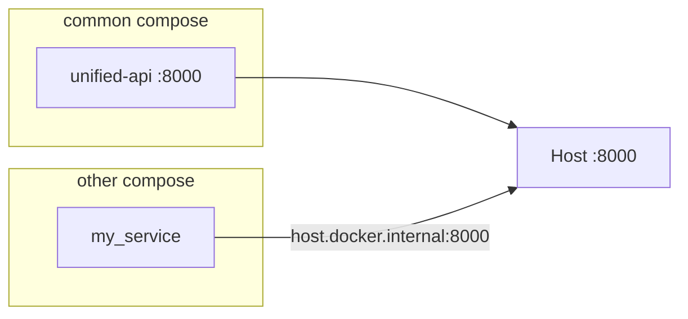
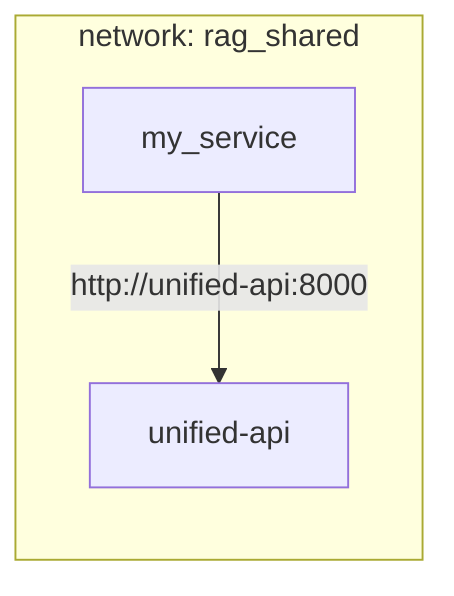
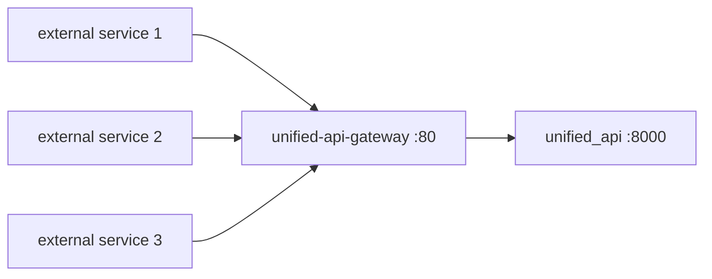

# Cross-compose integration

How an **external service** (launched in a **separate** Docker Compose project or container) calls the unified API from this repository.

## Context

The `common` stack runs `unified_api` on port **8000** inside the compose network. Each `docker compose up` creates its **own default network**. Containers in project B **cannot** resolve compose service names from project A (for example `unified_api`) unless you explicitly connect the networks.

Within **this** repo, `fin_rag` calls the unified API like this because both services share one compose file and network:

```yaml
LLM_SERVICE_BASE_URL: http://unified_api:8000/llm-service
```

An external project must use one of the options below.

## What external callers need

| Item | Detail |
|------|--------|
| **Protocol** | HTTP (REST) |
| **Contract** | [openapi.json](../openapi/openapi.json) or [by-service/](../openapi/by-service/) slices — see [openapi.md](./openapi.md) |
| **Paths** | Include the unified prefix (e.g. `/llm-service/llm/complete`, not `/llm/complete`) |
| **Health** | `GET /health` and per-service health routes — see [api-overview.md](./api-overview.md) |
| **Startup order** | Start the `common` stack and wait until `unified_api` is healthy before starting dependents |

Typical environment variables in the **consumer** service:

```bash
UNIFIED_API_BASE_URL=http://<reachable-host>:8000
LLM_SERVICE_BASE_URL=http://<reachable-host>:8000/llm-service
```

Replace `<reachable-host>` with the hostname from the chosen option below.

---

## Option comparison

| | Option 1: Host port | Option 2: Shared network | Option 3: Reverse proxy |
|--|---------------------|--------------------------|-------------------------|
| **Reachability** | Published host port `8000` | Shared Docker network | Stable hostname / TLS URL |
| **Consumer URL** | `http://host.docker.internal:8000` | `http://unified-api:8000` | `https://rag-api.example.com` |
| **Changes to `common` stack** | None (port already published) | Add external network + attach `unified_api` | Add proxy in front of `unified_api` |
| **Best for** | Dev, quick integration, separate repos | Co-located services on one Docker host | Multi-host, production, TLS |
| **DNS caveat** | Use `host.docker.internal` (+ Linux `extra_hosts`) | Use **container name** `unified-api`, not service name `unified_api` | Proxy handles routing |

---

## Option 1 — Host port (simplest)

The unified API already publishes port **8000** on the Docker host (`8000:8000` in `docker-compose.yml`). External containers reach it via the **host**, not internal compose DNS.

### Architecture



### Consumer compose example

```yaml
services:
  my_service:
    image: my-app:latest
    environment:
      UNIFIED_API_BASE_URL: http://host.docker.internal:8000
      LLM_SERVICE_BASE_URL: http://host.docker.internal:8000/llm-service
    extra_hosts:
      # Required on Linux; Docker Desktop provides this automatically on Mac/Windows
      - "host.docker.internal:host-gateway"
```

### Base URLs

| Caller location | Base URL |
|-----------------|----------|
| Host machine (curl, IDE) | `http://127.0.0.1:8000` |
| Container on same Docker host | `http://host.docker.internal:8000` |

### Example requests

```bash
curl -fsS http://host.docker.internal:8000/health
curl -fsS http://host.docker.internal:8000/llm-service/health
```

### Pros and cons

**Pros:** No changes to the `common` stack; works across repos and machines (when port is reachable).

**Cons:** Traffic goes host → published port → container; port conflicts if something else uses `8000` on the host.

### Sanity test from another container

```bash
docker run --rm --add-host=host.docker.internal:host-gateway \
  curlimages/curl:latest \
  curl -fsS http://host.docker.internal:8000/health
```

---

## Option 2 — Shared external Docker network

Attach both compose projects to a **named external network**. The consumer resolves the unified API by **container name** (`unified-api`) on port 8000 inside the network.

### Architecture



### Changes to `common` `docker-compose.yml`

Add a shared network and attach `unified_api`:

```yaml
networks:
  rag_shared:
    name: rag_shared
    driver: bridge

services:
  unified_api:
    container_name: unified-api
    networks:
      - default
      - rag_shared
    # ... existing config unchanged
```

Create the network once (if not created by compose):

```bash
docker network create rag_shared
```

### Consumer compose example

```yaml
networks:
  rag_shared:
    external: true

services:
  my_service:
    image: my-app:latest
    networks:
      - rag_shared
    environment:
      UNIFIED_API_BASE_URL: http://unified-api:8000
      LLM_SERVICE_BASE_URL: http://unified-api:8000/llm-service
```

### Service name vs container name

| Name | Resolves from |
|------|----------------|
| `unified_api` | **Same** compose project only (Docker Compose DNS) |
| `unified-api` | Any container on `rag_shared` (container name) |

External stacks should use **`http://unified-api:8000`**.

### Pros and cons

**Pros:** Direct container-to-container HTTP; no dependency on host port publishing; matches how `fin_rag` works inside this stack.

**Cons:** Both projects must agree on network name and wiring; only works when both run on the **same Docker host** (or same Swarm/Kubernetes overlay with equivalent setup).

---

## Option 3 — Reverse proxy (hostname / TLS)

Place nginx in front of `unified_api`. External services use a **stable URL**; the proxy forwards to the backend. This repo includes an optional **`unified_api_gateway`** service (nginx) for this pattern.

### What you need

| Requirement | Detail |
|-------------|--------|
| **Running stack** | `unified_api` healthy (databases + ollama up) |
| **Gateway service** | `unified_api_gateway` in `docker-compose.yml` |
| **Stable URL** | Set `UNIFIED_API_PUBLIC_URL` in `.env` — shared by all consumers |
| **Consumer config** | Each external service sets `UNIFIED_API_BASE_URL` to that URL |
| **OpenAPI contract** | Unchanged — [openapi.json](../openapi/openapi.json) paths still apply |
| **TLS (optional)** | Certs under `docker/nginx/certs/` + `ssl.conf` from example |

### Architecture (implemented in this repo)



External compose projects join the shared Docker network **`rag_shared`** and call the gateway by container name.

### Start the gateway (this repo)

From repo root, with `.env` configured:

```bash
docker compose --env-file .env up -d unified_api unified_api_gateway
```

Verify:

```bash
# Via gateway (recommended for external consumers)
curl -fsS http://127.0.0.1:8080/health
curl -fsS http://127.0.0.1:8080/llm-service/health

# Direct (dev/debug only — same host)
curl -fsS http://127.0.0.1:8000/health
```

Default host port for the gateway is **8080** (`UNIFIED_API_GATEWAY_PORT` in `.env.example`). `unified_api` still publishes **8000** for local development; point **external** services at the gateway only.

### Configure `.env`

```bash
UNIFIED_API_GATEWAY_PORT=8080
# Same-host Docker consumers (rag_shared network):
UNIFIED_API_PUBLIC_URL=http://unified-api-gateway
# Cross-host / production (DNS or load balancer in front of port 8080 or TLS):
# UNIFIED_API_PUBLIC_URL=https://rag-api.internal
```

### Wire each external compose project (3 services)

Every downstream stack needs:

1. Join **`rag_shared`** (created when you start `unified_api_gateway`).
2. Set base URL from `UNIFIED_API_PUBLIC_URL`.

```yaml
networks:
  rag_shared:
    external: true

services:
  my_service:
    image: my-app:latest
    networks:
      - default
      - rag_shared
    environment:
      UNIFIED_API_BASE_URL: http://unified-api-gateway
      LLM_SERVICE_BASE_URL: http://unified-api-gateway/llm-service
      DOC_PROCESSING_BASE_URL: http://unified-api-gateway/doc-processing
      CORE_RAG_BASE_URL: http://unified-api-gateway/core-rag
```

Use only the prefixes your service calls. Paths match [openapi.json](../openapi/openapi.json) (e.g. `POST /llm-service/llm/complete`).

**Startup:** start `common` stack (`unified_api` + `unified_api_gateway`) before external services. Poll `GET /health` on the gateway until `200`.

### Cross-host consumers (different machine / VPC)

When services are **not** on the same Docker host:

1. Publish the gateway on a host IP or load balancer (port **8080**, or **443** with TLS).
2. Create DNS (e.g. `rag-api.internal` → server IP).
3. Set `UNIFIED_API_PUBLIC_URL=https://rag-api.internal` on every consumer.
4. Optionally terminate TLS at nginx (see below) or at a cloud load balancer.

Consumers never reference `unified_api:8000` — only the public URL.

### Optional TLS

1. Generate or obtain certificates:

```bash
mkdir -p docker/nginx/certs
openssl req -x509 -nodes -days 365 -newkey rsa:2048 \
  -keyout docker/nginx/certs/privkey.pem \
  -out docker/nginx/certs/fullchain.pem \
  -subj "/CN=rag-api.internal"
```

2. Enable SSL config:

```bash
cp docker/nginx/ssl.conf.example docker/nginx/ssl.conf
```

3. Add to `unified_api_gateway` in `docker-compose.yml`:

```yaml
ports:
  - "${UNIFIED_API_GATEWAY_PORT:-8080}:80"
  - "${UNIFIED_API_GATEWAY_TLS_PORT:-8443}:443"
volumes:
  - ./docker/nginx/nginx.conf:/etc/nginx/conf.d/default.conf:ro
  - ./docker/nginx/ssl.conf:/etc/nginx/conf.d/ssl.conf:ro
  - ./docker/nginx/certs:/etc/nginx/certs:ro
```

4. Set `UNIFIED_API_PUBLIC_URL=https://rag-api.internal:8443` (or use standard `443` at a front load balancer).

Certs and `ssl.conf` are gitignored — do not commit private keys.

### Nginx config location

| File | Purpose |
|------|---------|
| `docker/nginx/nginx.conf` | HTTP proxy → `unified_api:8000` |
| `docker/nginx/ssl.conf.example` | Optional HTTPS template |
| `docker/nginx/certs/` | TLS key + cert (local only) |

### When to use Option 3

- **Multiple external services** (e.g. three or more consumers) sharing one stable entrypoint.
- Consumers on **different machines** or networks (with DNS + TLS).
- You want to **hide** direct port `8000` exposure later (firewall `8000`, allow gateway only).
- Future: auth, rate limits, or WAF at the edge without changing `unified_api`.

### Pros and cons

**Pros:** Production-friendly; one URL for all consumers; decouples clients from Docker internals; easy to add TLS and edge policies.

**Cons:** Extra container to run and monitor; TLS requires cert management; slight latency hop (negligible on same host).

---

## What not to do

1. **Do not** set `http://unified_api:8000` in an external compose file unless that service joins the same compose project or shared network (Option 2).
2. **Do not** point consumers at internal database hostnames (`postgres`, `neo4j`, `chroma`) unless you intentionally share infrastructure and have joined networks — normally consumers call **HTTP APIs only**.
3. **Do not** use legacy pre-unification OpenAPI snapshots (`docs/openapi/llm-service.json` without the `/llm-service` prefix). Use [openapi.json](../openapi/openapi.json) or [by-service/](../openapi/by-service/).
4. **Do not** assume the test stack port — live compose uses **8000**; `docker-compose-test.yaml` uses **18000** on the host.

---

## Recommended choice

| Situation | Option |
|-----------|--------|
| Local dev, separate repos, fastest path | **Option 1** — `host.docker.internal:8000` |
| Long-running co-located services on one server | **Option 2** — shared network `rag_shared` |
| Remote machine, TLS, or centralized ingress | **Option 3** — reverse proxy |

You can start with Option 1 and move to Option 2 or 3 without changing API paths — only the base URL in consumer env vars changes.

**Multiple external consumers:** use **Option 3** — start `unified_api_gateway` and set `UNIFIED_API_PUBLIC_URL` (see Option 3 section above).

---

## Readiness check

Before starting a dependent service:

```bash
# Live stack (host)
curl -fsS http://127.0.0.1:8000/health

# From consumer container (Option 1)
curl -fsS http://host.docker.internal:8000/health

# From consumer container (Option 2)
curl -fsS http://unified-api:8000/health

# Via gateway (Option 3 — recommended for external stacks)
curl -fsS http://127.0.0.1:8080/health
curl -fsS http://unified-api-gateway/health   # from container on rag_shared
```

Optional: wait for `unified_api` health in the consumer compose:

```yaml
depends_on:
  # Only works if unified_api is in the SAME compose file.
  # For external stacks, use a startup script or orchestrator health gate instead.
```

For cross-project dependencies, use a retry loop or external orchestration (systemd, CI, Kubernetes init containers) that polls `/health` until success.

---

## Related docs

- [openapi.md](./openapi.md) — OpenAPI exports and client generation
- [api-overview.md](./api-overview.md) — route prefixes and health endpoints
- [migration-notes.md](./migration-notes.md) — old microservice URLs → unified paths
- [configuration.md](./configuration.md) — unified API environment variables
- [compose-runbook.md](../compose-runbook.md) — operating the `common` stack
- [../openapi/openapi.json](../openapi/openapi.json) — full HTTP contract
